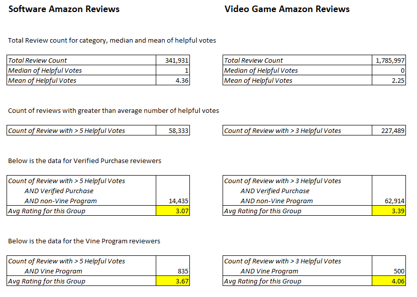

# Big Data Analysis

## Summary of Findings

The categories chosen for the big data analysis were Amazon reviews for Software and Video Game products.  

The table below summarizes the calculations and findings.  

## Methodology

The approach taken to verify if the Amazon Vine program to provide product reviews is biased or not was to compare reviews that had verified purchases against the vine reviews.  

A quick description of the Amazon Vine program can be found [here](https://www.amazon.com/vine/about?ie=UTF8).  

The first filter was to only look at reviews that had higher than average number of helpful vote ratings.  

The next step was to compare the average of ratings for verified purchases to those of the Vine program ratings.  

## Conclusion

For both the Software and Video Game product categories, it was found that the Vine program ratings were higher than the average of the verified purchase review ratings.  

This suggests that there is bias in the Amazon Vine program. It could be that receiving a product for free and reviewing it skews the judgment of the reviewer to choose a higher rating than for a reviewer who paid money to buy the product.